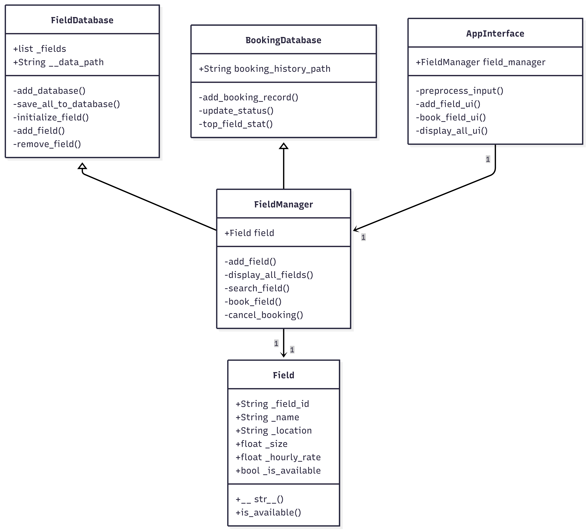
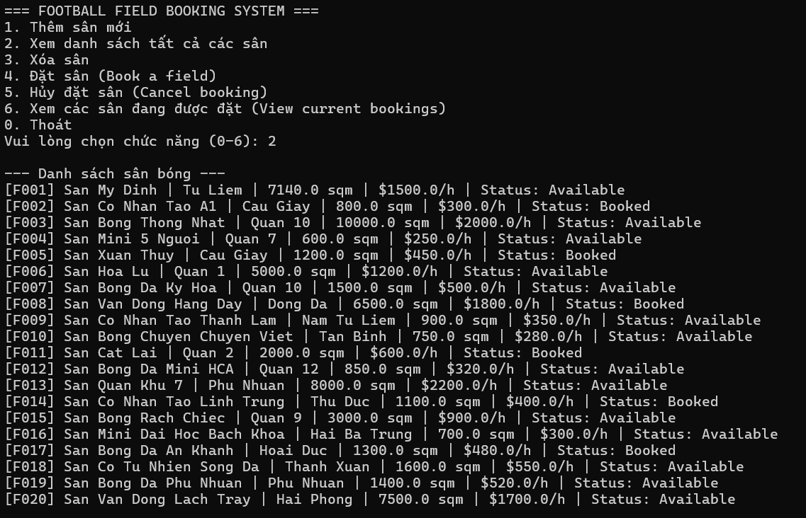
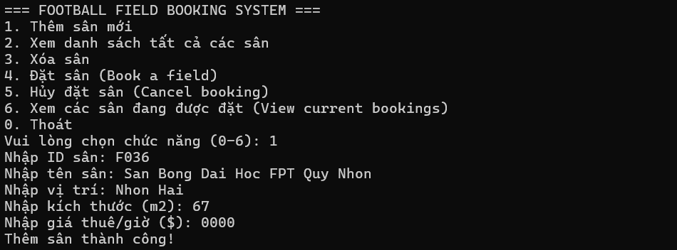
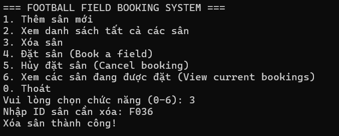
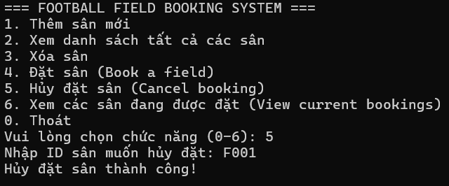
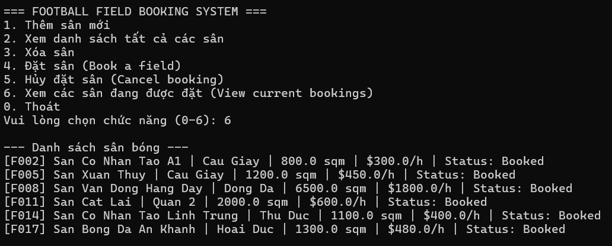

# Football-field-booking-pfp-191
# TECHNICAL REPORT

**Course:** PFP191 - Programming Fundamentals with Python

**Project Topic:** Football Field Booking System

**University:** FPT University 

**Main contributor:** Nguyễn Hải Ban

**Instructor:** Khoa Nguyễn

**Date:** 24/03/2026

---

## TABLE OF CONTENTS

1. Introduction
2. System Analysis and Design
3. Implementation Details
4. Advanced Features
5. Testing and Results
6. Conclusion

---

## 1. INTRODUCTION

### 1.1 Project Overview
In the digital era, automating sports facility management is essential for improving operational efficiency and providing a better user experience. This project focuses on designing and implementing a simple but practical Python-based Console-Line Interface (CLI) application to manage football field records and booking status. By replacing manual tracking with a structured digital system, the application makes it easier to store, update, and monitor field availability.

### 1.2 Project Objectives
The primary goal of this project is to develop a functional application that demonstrates a clear understanding of core Python programming concepts required by the PFP191 syllabus. Specifically, the project aims to:

* Apply **Object-Oriented Programming (OOP)** principles such as encapsulation, properties, and class-based design.
* Implement efficient data handling using a lightweight file-based persistence approach.
* Ensure data persistence through reusable File I/O utilities (`.txt` files).
* Organize code into a clean modular structure with separate files for models, services, and utilities.

### 1.3 Scope of Work
The system covers the following functional areas:

* **Field Data Management:** Add, display, and delete football field records.
* **Booking Management:** Mark a field as booked or available again.
* **Filtering Functionality:** Show only the fields that are currently booked.
* **Data Persistence:** Save and load field data from a text file.

---

## 2. SYSTEM ANALYSIS AND DESIGN

### 2.1 Functional Requirements
Based on the project code, the application interacts with users through a console menu providing six main functions: adding a new field, displaying all fields, deleting a field, booking a field, cancelling a booking, and viewing current bookings.

### 2.2 Class Architecture
The system is designed with a simple and clear structure, using the following classes and modules:

* `Field`: Represents a football field. It stores attributes such as field ID, name, location, size, hourly rate, and availability status.
* `FieldManager`: Handles the main business logic, including adding, deleting, booking, cancelling, and displaying fields.
* `file_io.py`: Provides reusable functions for saving data to and loading data from text files.
* `main.py`: Serves as the entry point of the application and connects user input with the manager class.

### 2.3 Modular Structure
To keep the code easy to maintain and extend, the project is separated into logical modules:

* `models/field.py`: Contains the `Field` class.
* `services/field_manager.py`: Contains the `FieldManager` class.
* `utils/file_io.py`: Contains generic file save/load functions.
* `main.py`: Contains the menu-driven user interface.

---

## 3. IMPLEMENTATION DETAILS

### 3.1 Object-Oriented Programming (OOP) Paradigm
**Encapsulation and Data Protection:**  
The `Field` class stores its attributes using protected-style variables such as `self._field_id` and `self._is_available`. Users do not change these values directly through the menu. Instead, the class exposes safe access through `@property` methods. This keeps the data structure clean and controlled.

```python
class Field:
    def __init__(self, field_id: str, name: str, location: str, size: float, hourly_rate: float, is_available: bool = True):
        self._field_id = field_id
        self._name = name
        self._location = location
        self._size = size
        self._hourly_rate = hourly_rate
        self._is_available = is_available

    @property
    def field_id(self):
        return self._field_id
```
**Abtraction**
The user (in `main.py`) only needs to call `manager.book_field(id)` to perform a booking. They do not need to know that the system is internally looping through a list, checking boolean statuses, or performing file I/O operations to persist the data.
```python
def book_field(self, field_id: str):
    for f in self.fields:
        if f.field_id == field_id:
            if f.is_available:
                f.is_available = False # Cập nhật trạng thái
                self.save_fields()     # Tự động lưu vào file vật lý
                print("Đặt sân thành công!")
            else:
                print("Sân này đã được đặt!")
            return
    print("Không tìm thấy mã sân!")
```
**Status Handling:**  
The `is_available` attribute uses a property with a setter so that booking and cancellation can update the field status in a controlled way.

### 3.2 File I/O and Data Persistence
The project uses plain text files to store field data. This makes the system simple, portable, and easy to understand.

* **Loading data:** When `FieldManager` starts, it calls `load_data_from_file()` to read existing field records from the storage file.
* **Saving data:** After each change such as adding, deleting, booking, or cancelling, the system calls `save_data_to_file()` to overwrite the file with the newest data.

```python
def save_data_to_file(filepath, data_list):
    try:
        with open(filepath, 'w', encoding='utf-8') as f:
            for item in data_list:
                f.write(item.to_csv_format() + '\n')
    except Exception as e:
        print(f"Không thể lưu dữ liệu: {e}")
```

### 3.3 Serialization and Deserialization
To make file storage possible, each `Field` object can convert itself into a CSV-style line and restore itself from that line later.

```python
def to_csv_format(self):
    return f"{self._field_id},{self._name},{self._location},{self._size},{self._hourly_rate},{self._is_available}"

@classmethod
def from_csv_format(cls, data_string: str):
    parts = data_string.strip().split(',')
    if len(parts) == 6:
        return cls(parts[0], parts[1], parts[2], float(parts[3]), float(parts[4]), parts[5] == 'True')
    raise ValueError("Dữ liệu không hợp lệ")
```

This design allows the program to load the exact same data format every time it starts.

---

## 4. ADVANCED FEATURES

### 4.1 Booking and Cancellation Logic
The `FieldManager` class controls booking status changes in a safe and readable way. When a user books a field, the system checks whether the field is currently available. If yes, the status changes to booked and the updated list is saved back to the file. The same logic is used for cancellation, but in reverse.

```python
def book_field(self, field_id: str):
    for f in self.fields:
        if f.field_id == field_id:
            if f.is_available:
                f.is_available = False
                self.save_fields()
                print("Đặt sân thành công!")
            else:
                print("Sân này đã được đặt!")
            return
```

### 4.2 Filtering Current Bookings
The system includes a simple filtering feature to display only booked fields. This helps users quickly see which fields are not available at the moment.

```python
def display_fields(self, filter_booked=False):
    for f in self.fields:
        if filter_booked and f.is_available:
            continue
        print(f)
```

### 4.3 Clean CLI Menu Design
The `main.py` file provides a menu-based interface using a continuous loop. This makes the application easy to use for beginners and suitable for demo presentations. The program also includes error handling for invalid input types such as non-numeric size or price values.

---

## 5. TESTING AND RESULTS

### 5.1 Testing Methodology
The system was tested manually with normal cases and edge cases to ensure correct behavior.

* **Data Integrity Testing:** Adding a field with an existing ID correctly triggers an error message.
* **Booking Validation:** Booking an available field changes its status to booked and saves the update.
* **Cancellation Validation:** Cancelling a field that is already available is blocked by the system.
* **File Persistence Testing:** Restarting the application still keeps previously saved data.

### 5.2 User Interface Demonstration
The Command Line Interface (CLI) provides a clear menu for users to interact with the system.

* **Original field dataset**


* **Operation 1: Add new field**


* **Operation 2: View all fields**


* **Operation 3: Delete field**

  

* **Operation 4: Book a field**


* **Operation 5: Cancel booking**

 

* **Operation 6: View current bookings**


---

## 6. CONCLUSION

### 6.1 Project Evaluation
The Football Field Booking System successfully meets the main requirements of a simple management application. The project demonstrates basic but effective use of Object-Oriented Programming, modular design, file handling, and status-based logic. It is suitable as a beginner-friendly console project for managing sports field data.

### 6.2 System Limitations
The current system stores data in plain text files, which is easy to implement but not ideal for large-scale or multi-user environments. In addition, there is no advanced validation for duplicate names, overlapping time slots, or reservation duration because the current design only tracks availability. Finally, there is no polymorphism, inheritance.

### 6.3 Future Enhancements
To improve this project in the future, the system could be expanded with:
* Time-based booking and hourly reservation management.
* User accounts and booking history.
* Database storage instead of text files.
* Provide polymorphism, inheritance as the instructor's requires.

